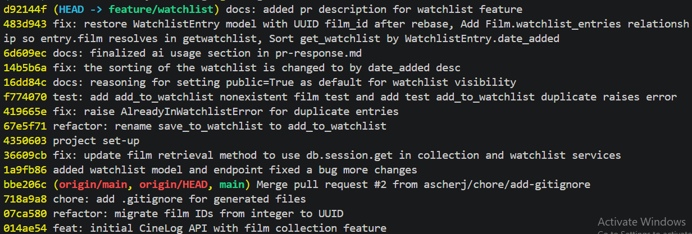

# PR Response Doc — CineLog Watchlist Feature

## AI Usage
<!-- Fill in at the end — how you used AI tools during this project -->

I used Claude for Comment 2 to explain how deduplication works in add_to_collection() to apply the same logic to add_to_watchlist(). I also used Cluaude to write a curl command to verify if the add_to_watchlist will throw an error for duplicates.

For Comment 3 i used github copilot autocomplete to adjust test_collection.py file content to create similar tests for test_watchlist.py. I also used claude when i got an import error when running pytest to spot a missing import instance.

For Comment 4 and 5 i used prompt "What counterargument would a careful code reviewer raise against this position? What tradeoff am I not acknowledging?" to challenge my position

For Comment 4 Claude gave interesting point about social graph and network effect that are important for engagement on social apps which is a strong arguement against making lists private by default. I used this point for my reasoning when writing my response to the review.

For Comment 5 Claude listed strong points to support the reviewer stance on sorting the watch;ist by date added. The points included  

-A watchlist is a queue, not an encyclopedia. The mental model of "films I want to watch" is temporal: what did I just add? and what's been rotting at the bottom for a year? 
-Alphabetical buries intent. The film you added 30 seconds ago could land on page 3 because its title starts with "Z". That's a surprising, almost hostile result right after the user's action — the thing they just did is invisible.
-Title sort has locale/article bugs. Film.title.asc() is a raw string sort: "The Godfather" files under T, "Æon Flux" and lowercase/accented titles sort unpredictably, and collation is DB-dependent. Date sort has none of this.

## Comment 1 — Rename
**What I did:** Renamed save_to_watchlist() to add_to_watchlist() in services/watchlist_service.py. Updated all references to use the new function name, including the call in routes/watchlist/watchlist.py.
**How I verified:** Confirmed that a project-wide search returned no remaining occurrences of save_to_watchlist(). Ran pytest on tests/test_collection.py

## Comment 2 — Deduplication
**What I did:** added AlreadyInWatchlistError: If the film is already in the user's watchlist. Added a condition to check if the film is already in the watchlist.

**How I verified:** I used curl command

```powershell
# Get the ID of the first film
$FID = (Invoke-RestMethod "http://127.0.0.1:5001/films/")[0].id

# Use an existing user ID (replace with a valid UUID if required)
$U = "550e8400-e29b-41d4-a716-446655440000"

# Request body
$body = @{ film_id = $FID } | ConvertTo-Json

Write-Host "--- 1st add (expect 201) ---"
try {
    (Invoke-WebRequest "http://127.0.0.1:5001/collection/$U/add" `
        -Method POST `
        -ContentType "application/json" `
        -Body $body).StatusCode
}
catch {
    Write-Host ("HTTP " + $_.Exception.Response.StatusCode.value__)
}

Write-Host "--- 2nd add (expect 409 Conflict) ---"
try {
    (Invoke-WebRequest "http://127.0.0.1:5001/collection/$U/add" `
        -Method POST `
        -ContentType "application/json" `
        -Body $body).StatusCode
}
catch {
    Write-Host ("HTTP " + $_.Exception.Response.StatusCode.value__)
    $_.ErrorDetails.Message
}
```

## Comment 3 — Missing test
**What I did:** Created a test_watchlist.py with two tests test_add_to_watchlist_duplicate_raises and test_add_to_watchlist_nonexistent_film_raises that test if the error is raised when added a duplicate to the watchlist and if adding nonexistent film raises an error respectively.
**How I verified:** I ran pytest for services/test_watchlist.py

## Comment 4 — Default visibility
**My position:** The watchlist should remain public by default
**Reasoning:**
A watchlist that's private-by-default in a social film-logging app means the network-effect feature (discovery, "what are my friends watching") starts empty. Public default is how you bootstrap the social graph and get engagement. Watchlist also doesn't contain any sensetive information. 
**Tradeoff acknowledged:** The decision is made for users and deprives users from the ability to control settings of the publicity of their watchlist. The feature that would alow users to toggle and change the access would address this concern.

## Comment 5 — Sort order
**My position:** The watchlist is sorted by date added in descending order
**Reasoning:** The watchlist sorted by date brings more value to users as users want to see what they added recently.
**Engagement with reviewer's point:** Although it is easier for users to find the film when they are sorted alphabetically, users often check what they added recently which make the sorting by date more convinient.

## Comment 6 — Rebase
**What conflicted:** .gitignore
**How I resolved it:** I compared two files and manually adjusted a 1 line difference. 
**How I verified no conflict remains:** After rebase i tried running pytest and failed. so i started looking closely in the difference between my contributions and other contributors. i found that the commit 07ca580 refactor: migrate film IDs from integer to UUID — which lives on main, not your branch — removed the whole WatchlistEntry class. SO it was a semantic conflict that i didn't notice. So i readded WatchlistEntry with updated UUID

## PR Description

### Overview
This PR adds a **watchlist** feature to CineLog, letting a user save films they want to watch (distinct from the collection, which logs films already watched). It introduces the `WatchlistEntry` model, a service layer (`services/watchlist_service.py`), and a route (`routes/watchlist/watchlist.py`), following the same structure as the existing collection feature.

### What's included
- **`add_to_watchlist(user_id, film_id)`** — saves a film to a user's watchlist. Raises `FilmNotFoundError` if the film doesn't exist and `AlreadyInWatchlistError` if it's already saved (deduplication mirrors `add_to_collection`).
- **`get_watchlist(user_id)`** — returns the user's watchlist films with `date_added` and `public` metadata attached, sorted by most recently added.
- **`WatchlistEntry` model** — `id`, `user_id`, `film_id` (all UUID strings), `date_added`, and a `public` visibility flag. A `Film.watchlist_entries` relationship exposes `entry.film`.
- **Tests** — `test_add_to_watchlist_duplicate_raises` and `test_add_to_watchlist_nonexistent_film_raises`.

### Design decisions
- **Visibility defaults to public** (`public=True`). In a social film-logging app, a private-by-default watchlist starts the discovery/"what are friends watching" features empty; a public default bootstraps the social graph, and a watchlist carries no sensitive data. Acknowledged trade-off: it decides visibility on the user's behalf — a future per-list toggle would restore that control. (See Comment 4.)
- **Sorted by `date_added` descending.** A watchlist is a queue, not an encyclopedia — users care most about what they just added, and alphabetical order buries recent intent and has locale/article sorting quirks. (See Comment 5.)
- **UUID film IDs.** `WatchlistEntry.film_id` is `String(36)` to match `Film.id` and `CollectionEntry.film_id` after the integer→UUID migration on `main`.

### Rebase note
Rebasing onto `main` surfaced a `.gitignore` conflict (resolved manually) and a **silent semantic conflict**: `main`'s UUID migration (`07ca580`) had deleted the `WatchlistEntry` class, and because this branch never edited that block, git replayed the deletion without flagging a conflict. Restored `WatchlistEntry` (with UUID `film_id`) and confirmed the branch history is linear with no merge commits. (See Comment 6.)

### Manual testing
1. Start the API (`flask run`, port 5001).
2. Add a film to a watchlist — expect `201`.
3. Add the same film again — expect `409` with `AlreadyInWatchlistError` (see the curl/PowerShell script under Comment 2).
4. `GET` the watchlist — confirm films return newest-first with `public: true`.
5. Run `pytest` — all watchlist and collection tests pass.

## Screenshot

